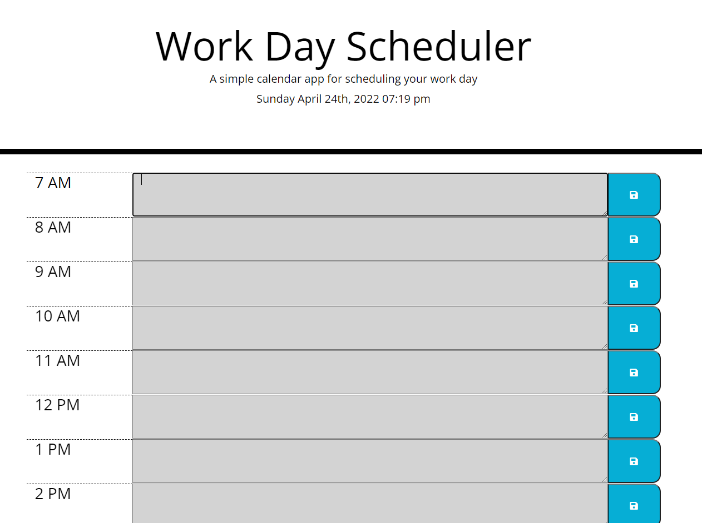

# Work Day Scheduler Starter Code

## Languages Used 
* JavaScript
* HTML
* CSS 
* Bootstrap
* jQuery

## Overview 

With this site you can layout your daily tasks and save them to local storage. The slots are colored to show the time of day and urgency for your tasks. Grey shows that the hour has passed, green shows the future hours still to pass, and red shows the current hour.

## Screenshot

